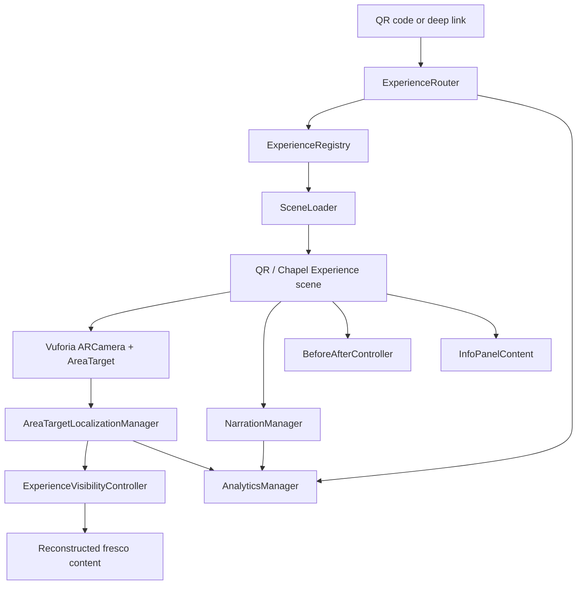

# Oystermouth Castle Heritage AR Architecture

## Production Scene Structure

- `Bootstrap`: Creates persistent services, applies app settings, initializes analytics, and loads the first public screen.
- `MainMenu`: Welcome, language selection, safety notice, experience selection, and QR entry point.
- `QRScanner`: Camera-based QR scan or deep-link handoff. Resolves payloads through `ExperienceRegistry`.
- `Chapel_Experience`: Vuforia ARCamera, AreaTarget, chapel lighting, reflection probe, fresco reconstructions, narration, before/after mode, and information panels.
- `Credits`: Project credits, research sources, funders, accessibility statement, and privacy policy.

The current `Assets/QR.unity` scene can act as the first `Chapel_Experience` scene until it is renamed.

## Technical Architecture Diagram



## QR Payload Contract

Supported payloads:

```text
chapel-fresco
https://oystermouth.example/experience/chapel-fresco?lang=en
{"experience":"chapel-fresco","lang":"cy"}
```

Future experience ids:

- `chapel-fresco`
- `tower-experience`
- `great-hall`

## UI Wireframe Structure

- `Welcome Screen`: app title, language toggle, start button.
- `Safety Screen`: phone/tablet awareness, no walking while looking at screen, supervised heritage-site use.
- `QR Scanner Screen`: camera preview, manual fallback button, "I am at the chapel" offline route.
- `Localization Screen`: Area Target instructions, scan-start image, tracking confidence message.
- `Experience HUD`: narration controls, before/after slider, info button, language/subtitles button.
- `Information Panels`: history, fresco reconstruction notes, research sources, credits.

## Localization Workflow

1. Show a safety screen before camera use.
2. Ask the visitor to face the chapel scan start zone.
3. Keep reconstruction roots hidden while Area Target status is searching.
4. Show reconstruction only when Vuforia status is `TRACKED` or `EXTENDED_TRACKED`.
5. If status becomes `LIMITED`, keep content visible briefly and show relocalization guidance.
6. If tracking is lost, hide sensitive overlays and ask the visitor to return to the start view.

## Content And Analytics

Content starts as local ScriptableObjects and JSON fallback. Staff-facing updates can later come from Firebase Remote Config, Supabase, or a small JSON CMS. Firebase Analytics events should mirror the methods already exposed by `AnalyticsManager`.

Tracked events:

- `app_launch`
- `qr_scan_success`
- `qr_scan_failure`
- `localization_success`
- `localization_failure`
- `narration_completion`
- `session_duration`

## Mobile Performance Rules

- Keep Area Target mesh and scanned render mesh separate where possible.
- Use ASTC textures for Android and iOS where supported.
- Keep fresco overlays transparent but simple. Prefer URP Unlit for painted overlays and URP Lit only when local lighting is important.
- Reflection probe resolution should stay at 64 or 128 for mobile.
- Realtime lights should be limited to the few real-world light sources that matter.
- Audio narration should stream compressed clips, not preload every language track.

## Deployment Roadmap

- Phase 1: Single Chapel Fresco experience, QR entry, Area Target localization, English/Welsh subtitles, pilot analytics.
- Phase 2: Add extra fresco elements, polished narration, staff-editable content JSON, better lost-tracking recovery.
- Phase 3: Full castle heritage trail with chapel, tower, great hall, shared CMS, visitor analytics dashboard, and public App Store / Play Store release.

## Risk Assessment

- Area Target drift: require physical on-site testing and a clear relocalization start point.
- Device performance variance: create low, medium, and high content quality presets.
- Poor lighting on site: use robust visitor instructions and avoid relying on visual polish that requires perfect lighting.
- Content governance: keep a reviewed local fallback so the public app remains usable without network access.
- Package sprawl: keep XREAL/OpenXR content out of the phone/tablet build profile unless it is actively needed.
